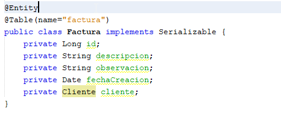

#**Servicios Web REST sobre Spring Boot con Maven en NetBeans:**

##1. **Configurar el Plugin de Spring Tools en NetBeans**

Se ingresa a Tools --> Plugins


Se abrirá la ventana de Plugins, damos click en la pestaña Available Plugins y Buscamos NB SpringBoot


##2. **Crear el Proyecto**

Vamos a File New Project…


Seleccionamos Java with Maven:


Digitamos el Nombre de nuestro grupo de paquetes, el Artifact, el Empaquetado, la descripción, el lenguaje Java y la version:


Agregamos las dependencias:


Agregamos el nombre y ubicación del proyecto:


##3. **Crear la base de datos**

Ingresar a su manejador de base de datos y ejecutar el comando, para crear la base de datos:

 CREATE DATABASE webinarunab;


##4. **Cargar Configuración en el application.properties**

Una vez creado el proyecto, vamos al **application.properties,**  donde vamos a indicar la cadena de conexión de MySQL, el puerto por el que va correr el API y los parámetros del hibérnate, así:

```
server.port=9011

spring.datasource.url=jdbc:mysql://localhost:3306/webinarunab

spring.datasource.username=root

spring.datasource.password=*******

## Hibernate Properties

# The SQL dialect makes Hibernate generate better SQL for the chosen database

spring.jpa.properties.hibernate.dialect = org.hibernate.dialect.MySQL8Dialect

# Hibernate ddl auto (create, create-drop, validate, update)

spring.jpa.hibernate.ddl-auto = create
```

**Nota:** Modificar los datos correspondientes según la configuración de servidor de mysql, cambiando el nombre de la base de datos, si la crearon diferente, cambiando el username por su usuario y los asteriscos ***** por la password del usuario del MySQL.

##5. **Crear Los Paquetes**

El siguiente paso es crear los paquetes debajo del paquete principal donde se encuentra la clase @SpringBootApplication, la estructura debe quedar de la siguiente manera:

Para crear un paquete se debe dar click derecho sobre el paquete principal, luego New--> Java Package…


**Creamos el Paquete Models:**


**Creamos el Paquete Repositories**:


**Creamos el Paquete Services:**


**Creamos el SubPaquete Impls:**

Este es el subpaquete que implementa las interfaces de nuestro paquete services, por lo cual se debe crear debajo de services, dando click derecho sobre service --> new --> Java Package…


**Creamos el Paquete Controllers:**


##6. **Creamos Las Clases de Models**

**Paso 1:** Estas clases serán nuestras Entity, por lo cual las debemos crear dando click derecho sobre el paquete Models, new --> Java Class…


Digitamos el nombre de la clase:


**Paso 2:** Una vez creada la Clase Le Agregamos la Anotación @Entity, adicionalmente es una buena practica que las clases del Models implementen la interface Serealizable, eso lo agregamos en la declaración de la clase con implements Serializable:

Nota: Importante cuando estemos agregando las anotaciones importar las respectivas clases necesarias, las de persistencia se importan de javax.persistence.Table:


Si estamos trabajando con un IDE o un editor de código con un buen plugin, cuando agreguemos las anotaciones @Entity y @Table, nos va a proponer que implementemos el comportamiento de la interfaz se realizable:


**Paso 3:** Luego declaramos los campos de la entidad y debe quedar así:


**Crear Clase Factura:**

Repetimos los pasos 1, 2 y 3 del punto 6, para que nos quede una clase Factura Así: 




Una vez tenemos las clases de esta manera vamos a dar un vistazo al modelo entidad relación donde se especifican las relaciones, este es un ejercicio básico con 3 tablas de las cuales vamos a desarrollar dos:

 

Nota: los ides fueron modificados para simular en el programa de diseño el nombre con que SpringBoot Crea las relaciones foráneas, pero en la clase el id de cada entidad, será nombrado como “id” autoincrementadle.

En este punto vamos a editar el archivo POM.xml para agregar una dependencia de validación:
```
<dependency> 

    <groupId>org.springframework.boot</groupId> 

    <artifactId>spring-boot-starter-validation</artifactId> 

</dependency>
```


**Revisamos las condiciones de la entidad Cliente:**


Con este planteamiento debemos agregar las respectivas anotaciones a cada campo según los detalles de cada uno:

- Al id le agregamos la anotación @Id para identificarla como llave primaria de la entidad y el @GeneratedValue(strategy = GenerationType.IDENTITY) para que este sea autoincrementable.
- Al nombre le agregamos la anotación @NotEmpty(message = "no puede estar vacio") con un mensaje, indicando que este no puede ser vacio, el @Size(min = 4, max = 12, message = "el tamaño tiene que estar entre 4 y 12") para especificar el tamaño mínimo y máximo del nombre, con el respectivo mensaje informativo y el @Column(nullable = false, length=30)) indicado que este campo es NOT NULL y largo de 30.
- Al apellido le agregamos @NotEmpty(message = "no puede estar vacio") y   @Column(nullable = false, length=30).
- Al mail le agregamos @NotEmpty(message = "no puede estar vacio"), la validacion @Email(message = "no es una dirección de correo bien formada") y  @Column(nullable = false, unique = true) NOT NULL y que no se pueda repetir.
- A la fechaCreacion le agregamos el @Column(name = "fecha_creacion") le ponemos un nombre y @Temporal(TemporalType.DATE) para que lo interprete como tipo DATE.

En aras de optimizar el API, vamos a agregar una vinculación de la relación de uno a muchos que tiene con la Entidad Factura, esto con el objetivo de que en el momento de hacer un llamado al cliente, no regrese las facturas que tiene dicho cliente, para eso vamos a crear otro campo de tipo Lista que retorna facturas; List<Factura>  y le vamos agregar las anotaciones @JsonIgnoreProperties(value={"cliente", "hibernateLazyInitializer", "handler"}, allowSetters=true) para que hibernate no lo cree como campo de la tabla,	@OneToMany(fetch = FetchType.LAZY, mappedBy = "cliente", cascade = CascadeType.ALL) indicando la relación de uno a muchos la cual se ejecutara en modo Lazy, para que se cargue cuando se necesiten, mapeado por el cliente, que es el campo declarado en la  tabla factura como llave foránea y la propiedad cascade, para que respete la jerarquía según las relaciones de la tabla, es decir si deseamos borrar un cliente, en cascada se borraran las facturas.

Luego insertamos el constructor, únicamente cargándole el campo facturas que son las que serán variables:

Paso 1: Click derecho Insert Code…


Paso 2: Click en Constructor:


Paso 3: Click en facturas y luego Generate:


Después, click derecho insert code --> Getter and Setter y seleccionamos todo:


Finalmente agregaremos un método con la anotación @PrePersist para asignar la fecha de creación de cliente antes de guardar, es un método de preguardado. 
```
@PrePersist
public void prePersist() {

		this.fechaCreacion = new Date();

}
```
La Clase Cliente, queda así:

```
import com.fasterxml.jackson.annotation.JsonIgnoreProperties;
import java.io.Serializable;
import java.util.ArrayList;
import java.util.Date;
import java.util.List;
import javax.persistence.CascadeType;
import javax.persistence.Column;
import javax.persistence.Entity;
import javax.persistence.FetchType;
import javax.persistence.GeneratedValue;
import javax.persistence.GenerationType;
import javax.persistence.Id;
import javax.persistence.OneToMany;
import javax.persistence.PrePersist;
import javax.persistence.Table;
import javax.persistence.Temporal;
import javax.persistence.TemporalType;
import javax.validation.constraints.Email;
import javax.validation.constraints.NotEmpty;
import javax.validation.constraints.NotNull;
import javax.validation.constraints.Size;
 
@Entity

@Table(name = "cliente")

public class Cliente implements Serializable {
    @Id
    @GeneratedValue(strategy = GenerationType.IDENTITY)
    private Long id;
    @NotEmpty(message = "no puede estar vacio")
    @Size(min = 4, max = 12, message = "el tamaño tiene que estar entre 4 y 12")
    @Column(nullable = false, length = 30)
    private String nombre;
    @NotEmpty(message = "no puede estar vacio")
    @Column(nullable = false, length = 30)
    private String apellido;
    @NotEmpty(message = "no puede estar vacio")
    @Email(message = "no es una dirección de correo bien formada")
    @Column(nullable = false, unique = true)
    private String email;
    //@NotNull(message = "no puede estar vacio")
    @Column(name = "fecha_creacion")
    @Temporal(TemporalType.DATE)
    private Date fechaCreacion;
	
    @JsonIgnoreProperties(value = {"cliente", "hibernateLazyInitializer", "handler"}, allowSetters = true)
    @OneToMany(fetch = FetchType.LAZY, mappedBy = "cliente", cascade = CascadeType.ALL)
    private List<Factura> facturas;

    @PrePersist
    public void prePersist() {
        System.out.println("Preguardado");
        this.fechaCreacion = new Date();
    }

    public Cliente() {
        this.facturas = new ArrayList<>();
    }

    public Long getId() {
        return id;
    }

    public void setId(Long id) {
        this.id = id;
    }

    public String getNombre() {
        return nombre;
    }

    public void setNombre(String nombre) {
        this.nombre = nombre;
    }

    public String getApellido() {
        return apellido;
    }

    public void setApellido(String apellido) {
        this.apellido = apellido;
    }

    public String getEmail() {
        return email;
    }

    public void setEmail(String email) {
        this.email = email;
    }

    public Date getFechaCreacion() {
        return fechaCreacion;
    }

    public void setFechaCreacion(Date fechaCreacion) {
        this.fechaCreacion = fechaCreacion;
    }

    public List<Factura> getFacturas() {
        return facturas;
    }

    public void setFacturas(List<Factura> facturas) {
        this.facturas = facturas;
    }
}

```
**Revisamos las condiciones de la entidad Factura:**


Con este planteamiento debemos agregar las respectivas anotaciones a cada campo según los detalles de cada uno:

- Al Id @Id y @GeneratedValue(strategy = GenerationType.IDENTITY), llave primaria y autoincrementadle.
- A la descripción @Column(nullable = false, length=200).
- A la observación @Column(nullable = false, length=500)
- A la fechaCreacion el @Column(name = "fecha\_creacion") y @Temporal(TemporalType.DATE)
- Al cliente @JsonIgnoreProperties(value={"factura", "hibernateLazyInitializer", "handler"}, allowSetters=true) y @ManyToOne(fetch = FetchType.LAZY) el JsonIgnore y la relación de mucho a uno, aquí no es necesario especificarle el nombre del campo en la tabla, por que por defecto SpringBoot lo crea siguiendo, la lógica del nombre de la clase seguido de raya al piso id así: cliente\_id.

Finalmente agregaremos un método con la anotación @PrePersist para asignar la fecha de creación de cliente antes de guardar, es un método de preguardado. 
```
@PrePersist

    public void prePersist() {

            this.fechaCreacion = new Date();

    }
```
Agregamos Los Getter y Setter, luego la Clase Factura Quedaría Así:

```
 

@Entity

@Table(name="factura")

public class Factura implements Serializable {

    @Id

    @GeneratedValue(strategy = GenerationType.IDENTITY)

    private Long id;

    @Column(nullable = false, length=200)

    private String descripcion;

    @Column(nullable = false, length=500)

    private String observacion;

    @Column(name = "fecha\_creacion")

    @Temporal(TemporalType.DATE)

    private Date fechaCreacion;

    @JsonIgnoreProperties(value={"factura", "hibernateLazyInitializer", "handler"}, allowSetters=true)

    @ManyToOne(fetch = FetchType.LAZY)

    private Cliente cliente;


    @PrePersist

    public void prePersist() {

            this.fechaCreacion = new Date();

    }

    public Long getId() {

        return id;

    }

    public void setId(Long id) {

        this.id = id;

    }

    public String getDescripcion() {

        return descripcion;

    }

    public void setDescripcion(String descripcion) {

        this.descripcion = descripcion;

    }

    public String getObservacion() {

        return observacion;

    }

    public void setObservacion(String observacion) {

        this.observacion = observacion;

    }

    public Date getFechaCreacion() {

        return fechaCreacion;

    }

    public void setFechaCreacion(Date fechaCreacion) {

        this.fechaCreacion = fechaCreacion;

    }

    public Cliente getCliente() {

        return cliente;

    }

    public void setCliente(Cliente cliente) {

        this.cliente = cliente;

    }

}
```

##7. **Creamos Las Interfaces del Repositories:**

Si estamos utilizando un buen plugin este proceso es sencillo, si lo que queremos es utilizar el repositorio solo para un crud, siguiendo los siguientes pasos, de igual manera si lo vamos hacer a mano creando la interface y heredando de la clase CrudRepository o JpaRepository según lo que se desee, la diferencia entre los dos es que Jpa incluye mas anotaciones para personalizar nuestro repositorio.

Vamos a dar click derecho sobre el paquete respositories --> New --> Repository Interface 


Digitamos el nombre ClienteRepository, La interface base, le Entidad y el Tipo de dato del Id de la Clase Entidad:


Nota: si no encontramos entre los primeros se debe buscar en Other así, en la categoría Spring Framework estan las Clases e Interfaces, que podrán creadas con un ayuda del plugin:


Quedará así:


Una vez Creada debemos importar la clase entidad, para corregir el error que vemos en la imagen.

La clase **ClienteRepository** quedaría así:

```
package com.example.webinaUnab.repositories;

import com.example.webinaUnab.models.Cliente;
import org.springframework.data.jpa.repository.JpaRepository;

/**
 *
 * @author Marlon
 */
public interface ClienteRepository extends JpaRepository<Cliente, Long> {
    
}

Repetimos el proceso para agregar la clase FacturaRepository:


la cual quedaría así:

package com.example.webinaUnab.repositories;

import com.example.webinaUnab.models.Factura;

import org.springframework.data.jpa.repository.JpaRepository;

/\\**

 \**

 \ @author Marlon

 \/

public interface FacturaRepository extends JpaRepository<Factura, Long> {
\


}
```

##8. **Creamos las Interfaces de los Services**

Se crea una nueva interface, pero ojo es importante que este se cree sobe el paquete service, teniendo en cuenta que al crear el paquete service y el subpaquete impls, queda todo el subpaquete asi:


Con lo cual en el momento de crear la interface se debe modificar dejando claro que esa interface se va crear sobre el paquete services, especificando el siguiente parámetro en el package: com.example.webinaUnab.services.

Adicionalmente es una buena practica al momento de nombrarlo agregarle la inicial  “I” que la identifica como Interface, luego el nombre de la Entidad y El apellido serie el Paquete Service quedando IClienteService y IFacturaService:


Creamos la interface y agregamos las funciones y métodos:

- findAll retorna una lista de objetos Cliente:

public List<Cliente> findAll();

- findAll retorna un objeto Page con Cliente:

public Page<Cliente> findAll(Pageable pageable);

- findById recibe como parámetro el id y retorna un Cliente:

	public Cliente findById(Long id);

- save, recibe un Cliente y retorna un Cliente:

	public Cliente save(Cliente cliente);

- delete, recibe el id para borrar el Cliente:

	public void delete(Long id);

Esos son los métodos básicos para hacer un CRUD, la interface **IClienteService** quedaría así:

```
import com.example.webinaUnab.models.Cliente;
import java.util.List;
import org.springframework.data.domain.Page;
import org.springframework.data.domain.Pageable;

/**
 *
 * @author Marlon
 */
public interface IClienteService {
        
        public List<Cliente> findAll();
	
	public Page<Cliente> findAll(Pageable pageable);
	
	public Cliente findById(Long id);
	
	public Cliente save(Cliente cliente);
	
	public void delete(Long id);
	 
}

```
Repetimos los mismos pasos para crear todas las interfaces, para continuar con lo que venimos desarrollando, la Interface IFacturaService quedaría así:

```

import com.example.webinaUnab.models.Factura;
 
import java.util.List;
import org.springframework.data.domain.Page;
import org.springframework.data.domain.Pageable;

/**
 *
 * @author Marlon
 */
public interface IFacturaService {
        
        public List<Factura> findAll();
	
	public Page<Factura> findAll(Pageable pageable);
	
	public Factura findById(Long id);
	
	public Factura save(Factura factura);
	
	public void delete(Long id);
	 
}

```

##9. **Implementamos las Interfaces de los Services**

El plugin de NetBeans también nos ayuda en la creación de una clase service, pero si se decide hacer a mano es solo crear una nueva clase y agregarle la anotación @service:

**Paso 1:** Crear La Clase


Asignamos el nombre **ClienteServiceImpl** y click en Finish:


**Paso 2:** Declaramos que esta interface implementa los metodos de IClienteService con:

implements IClienteService

Luego importamos IClienteService y nos pedirá que implementemos los métodos de la interface:


**Paso 3:** Una vez se implementan los métodos estos se crean con una interrupción como código, la cual debemos borrar y codificar las verdaderas funciones de cada método:


**Paso 4:** Pero antes de esto vamos a inyectar con la anotación @Autowired una variable te tipo del Repositorio correspondiente a Cliente, la cual es ClienteRepository

@Autowired

private ClienteRepository clienteRepository;

**Paso 5:** En este paso vamos a codificar los métodos, sobre el nombre de cada método vamos agregar la anotación @Transactional(readOnly = true) para identificar que es un método de tipo transaccional, luego quitamos la interrupción throw.

Es importante cuando importemos la clase revisar que lo importemos de springbootframework para evitar errore:


**Función findAll:** esta función retorna una lista de tipo Cliente, la cual la obtenemos invocando el método findAll heredado de JpaRepository para la Entidad Cliente, usando la variable del repositorio clienteRepository.findAll(), el return quedaría así:

**return (List<Cliente>) clienteRepository.findAll();**

**Función findAll(Pageable pageable):** esta función retorna una lista paginada de clientes, la cual obtenemos llamando el método **findAll(Pageable pageable)** que recibe un objeto pageable, el return quedaría así:

**return clienteRepository.findAll(pageable);** 

**Función findById:** esta función recibe el id de un Cliente los busca y lo retorna, con lo cual el return se hace mediante el método **findById(id)** que recibe un id y con la ayuda del submetodo orElse(null) retorna null si no lo encuentra, el return quedaría así:

**return clienteRepository.findById(id).orElse(null);**  

**Función save:** esta función recibe un objeto de tipo Cliente y con la ayuda del clienteRepository, invoca el método **save(cliente)** que recibe el objeto Cliente y lo guarda en la tabla cliente, luego lo retorna, el código quedaría así:

**return clienteRepository.save(cliente);**

**Metodo delete:** este método recibe un id de tipo long y mediante el clienteRepository, invoca el método **delete(id)** que esta diseñado por JpaRepository para eliminar un objeto de la tabla cliente cuando este coincida con el id recibido, el código quedaría asi:

**clienteRepository.deleteById(id);**

La Clase ClienteServiceImpl quedaría así:

```

import com.example.webinaUnab.models.Cliente;
import com.example.webinaUnab.repositories.ClienteRepository;
import com.example.webinaUnab.services.IClienteService;
import java.awt.print.Pageable;
import java.util.List;
import org.springframework.beans.factory.annotation.Autowired;
import org.springframework.data.domain.Page;
import org.springframework.stereotype.Service;
import org.springframework.transaction.annotation.Transactional;

/**
 *
 * @author Marlon
 */
@Service
public class ClienteServiceImpl implements IClienteService {

    @Autowired
    private ClienteRepository clienteRepository;

    @Override
    @Transactional(readOnly = true)
    public List<Cliente> findAll() {
        return (List<Cliente>) clienteRepository.findAll();
    }

    @Override
    @Transactional(readOnly = true)
    public Page<Cliente> findAll(org.springframework.data.domain.Pageable pageable) {
        return clienteRepository.findAll(pageable);
    }

    @Override
    @Transactional(readOnly = true)
    public Cliente findById(Long id) {
        return clienteRepository.findById(id).orElse(null);
    }

    @Override
    public Cliente save(Cliente cliente) {
        return clienteRepository.save(cliente);
    }

    @Override
    public void delete(Long id) {
        clienteRepository.deleteById(id);
    }

}

```

Repetimos los paso 1, 2, 3, 4 y 5 con las demás servicios y los implementamos según las interfaces creadas, para seguir con el proyecto como lo llevamos la clase FacturaServiceImpl quedaría así:

```
import com.example.webinaUnab.models.Factura;
import com.example.webinaUnab.repositories.FacturaRepository;
import com.example.webinaUnab.services.IFacturaService;
import java.util.List;
import org.springframework.beans.factory.annotation.Autowired;
import org.springframework.data.domain.Page;
import org.springframework.data.domain.Pageable;
import org.springframework.stereotype.Service;
import org.springframework.transaction.annotation.Transactional;

/**
 *
 * @author Marlon
 */
@Service
public class FacuraServiceImpl implements IFacturaService {

    @Autowired
    private FacturaRepository facturaRepository;

    @Override
    @Transactional(readOnly = true)
    public List<Factura> findAll() {
        return (List<Factura>) facturaRepository.findAll();
    }

    @Override
    @Transactional(readOnly = true)
    public Page<Factura> findAll(Pageable pageable) {
        return facturaRepository.findAll(pageable);
    }

    @Override
    @Transactional(readOnly = true)
    public Factura findById(Long id) {
        return facturaRepository.findById(id).orElse(null);
    }

    @Override
     public Factura save(Factura factura) {
        return facturaRepository.save(factura);
    }

    @Override
    public void delete(Long id) {
        facturaRepository.deleteById(id);
    }

}
```

##10.  **Crear los Controllers**

El ultimo paso para verificar el funcionamiento de nuestra API, donde se van a configurar las rutas URI y los Métodos Utilizados en el APIREST se deben crear los controladores uno por cada servicio implementado, el plugin de NetBeans nos ayuda a crearlos, pero también se puede crear a mano agregando la anotación @RestController.

**Paso 1:** Damos Click derecho sobre el paquete controllers-->new-->RestController Class…


El plugin nos ayuda a crear los métodos para el CRUD y validar los errores HTTP, si deseamos que sean generados automáticamente debemos chequear Generate CRUD methods:


Esto crea automáticamente un controlador con rutas URI por defecto y códigos Métodos que retornan ResponseEntity para el manejo de códigos de estado HTTP, en los métodos del CRUD, adicionalmente nos genera los métodos de comunicación de la API, GET, PUT, POST, DELETE:


**Paso 2:** Procedemos a editar la URI y a codificar cada uno de los métodos los cuales por defecto cuando se crean automáticamente retornan null, es decir hay que codificarle los métodos de los servicios.

Una vez editemos el método del encabezado vamos a agregar la anotación @CrossOrigin(origins = { "http://localhost:4200", "*" }) donde podemos indicarle desde que URL se va consumir la API, en este ejemplo agregamos localhost:4200 y \ este ultimo permite peticiones de cualquiera, esto es lo que se conoce como validación de CORS(Intercambio de Orígenes Cruzado). Cross-origin resource sharing es lo que nos da el acceso a los recursos esta anotación puede ser personalizada por cada método o se puede agregar a todo el controlador.

**Paso 3:** Procedemos a inyectar la variable del servicio con la anotación @Autowired, podemos inyectar la interface, java toma por defecto la clase que implementa los métodos de la interface, quedando así:

```
@Autowired
```
private IClienteService clienteService;

**Paso 4:** Codificar Funciones y Métodos del Controlador.

**Función list:** Retorna una lista de objetos Cliente, la codificación quedaría así, invocando el medido findAll() del servicio:
```
@GetMapping()

public List<Cliente> list() {

	**return clienteService.findAll();**

}
```

**Función index:** Esta función retorna un objeto Page<Cliente> de tipo cliente, que recibe un valor integer con el numero de pagina que se desea retornar, el código quedaría así:
```
@GetMapping("/clientes/page/{page}")

public Page<Cliente> index(@PathVariable Integer page) {

		Pageable pageable = PageRequest.of(page,4);

		return clienteService.findAll(pageable);

}
```

**Función get:** Esta función recibe un parámetro id y retorna un Objeto Cliente en formato Json, con lo cual para personalizar la respuesta en caso que no exista, se creo además del objeto Cliente, un Mapa que contiene una respuesta, con un mensaje de error, esta funcion tambien retorna además de la respuesta un código de estado HTTP, quedando así:
```
@GetMapping("/{id}")

public ResponseEntity<?> get(@PathVariable Long id) {

	Cliente cliente = null;

	Map<String, Object> response = new HashMap<>();

	try {

		cliente = clienteService.findById(id);

	} catch (DataAccessException e) {

		response.put("mensaje", "Error al realizar la consulta en la base de datos");

		response.put("error", e.getMessage().concat(": ").concat(e.getMostSpecificCause().getMessage()));

		return new ResponseEntity<Map<String, Object>>(response, HttpStatus.INTERNAL\_SERVER\_ERROR);

	}

	if (cliente == null) {

		response.put("mensaje", "El cliente ID: ".concat(id.toString().concat(" no existe en la base de datos!")));

		return new ResponseEntity<Map<String, Object>>(response, HttpStatus.NOT\_FOUND);

	}

	return new ResponseEntity<Cliente>(cliente, HttpStatus.OK);

}
```

**Función put:** esta función retorna un código de estado HTTP, esta validado con la anotación @Valid y recibe del @RequestBody un cliente con los nuevos datos, BindingResult result para la validación de la dependencia validator y @PathVariable Long id con el identificador del cliente que se va actualizar.

Lo siguiente es buscar el cliente que se va actualizar:

**Cliente clienteActual = clienteService.findById(id);**

Declaramos una variable de tipo Cliente donde se va cargar los datos del cliente actualizado:

**Cliente clienteUpdated = null;**

Declaramos un mapa para manejar la respuesta:

**Map<String, Object> response = new HashMap<>();**

Si el validador saca error responderemos con los parametros de respuesta que le agregamos a la validación, los cuales cargamos en una lista de tipo String de nombre errors, cargamos la lista al mapa response.put(“errors”, errors) y retornamos el mapa con el código HTTP Bad Request:
```
if (result.hasErrors()) 

            List<String> errors = result.getFieldErrors()

                    .stream()

                    .map(err -> "El campo '" + err.getField() + "' " + err.getDefaultMessage())

                    .collect(Collectors.toList());
```
Luego si el cliente es nulo retornamos el mapa con un mensaje indicando que no existe en la base de datos:
```
response.put("errors", errors);

return new ResponseEntity<Map<String, Object>>(response, HttpStatus.BAD\_REQUEST);

        }
```
Si todo esta correcto actualizamos el cliente, cargándolo al mapa y lo retornamos como respuesta con el código Created:

```
try {

            clienteActual.setApellido(cliente.getApellido());

            clienteActual.setNombre(cliente.getNombre());

            clienteActual.setEmail(cliente.getEmail());

            clienteActual.setFechaCreacion(cliente.getFechaCreacion());

            clienteUpdated = clienteService.save(clienteActual);

        } catch (DataAccessException e) {

            response.put("mensaje", "Error al actualizar el cliente en la base de datos");

            response.put("error", e.getMessage().concat(": ").concat(e.getMostSpecificCause().getMessage()));

            return new ResponseEntity<Map<String, Object>>(response, HttpStatus.INTERNAL\_SERVER\_ERROR);
        }

        response.put("mensaje", "El cliente ha sido actualizado con éxito!");

        response.put("cliente", clienteUpdated);

return new ResponseEntity<Map<String, Object>>(response, HttpStatus.CREATED);
```

**Función create:** Este método esta validado con el @Valid y recibe mediante el @RequestBody un objeto Cliente cliente y BindingResult result para validar.

Declaramos la variable Cliente que vamos a retornar:

**Cliente clienteNew = null;**

Declaramos también el mapa para la respuesta personalizada:

**Map<String, Object> response = new HashMap<>();**

Validamos si hay errores, los capturamos en una lista y los cargamos al mapa para responder con un código Bad Request:

```
if (result.hasErrors()) {

            List<String> errors = result.getFieldErrors()

                    .stream()

                    .map(err -> "El campo '" + err.getField() + "' " + err.getDefaultMessage())

                    .collect(Collectors.toList());

            response.put("errors", errors);

            return new ResponseEntity<Map<String, Object>>(response, HttpStatus.BAD\_REQUEST);

        }
```
Si todo es correcto ejecutamos el método sabe, si por algún motivo el método sabe falla, se captura la excepción y se retorna un HTTP de error interno del servidor, si no hay excepciones se carga el mapa de respuesta que incluye el objeto cliente que esta en la variable clienteNew:
```
try {

            clienteNew = clienteService.save(cliente);

        } catch (DataAccessException e) {

            response.put("mensaje", "Error al realizar el insert en la base de datos");

            response.put("error", e.getMessage().concat(": ").concat(e.getMostSpecificCause().getMessage()));

            return new ResponseEntity<Map<String, Object>>(response, HttpStatus.INTERNAL\_SERVER\_ERROR);

        }

        response.put("mensaje", "El cliente ha sido creado con éxito!");

        response.put("cliente", clienteNew);

        return new ResponseEntity<Map<String, Object>>(response, HttpStatus.CREATED);
```

**Función Delete:** esta función recibe como parámetro el id del cliente, el cual se va enviar en el delete, también declaramos un mapa para la respuesta:

```
Map<String, Object> response = new HashMap<>();

        try {

             clienteService.delete(id);

        } catch (DataAccessException e) {

            response.put("mensaje", "Error al eliminar el cliente de la base de datos");

            response.put("error", e.getMessage().concat(": ").concat(e.getMostSpecificCause().getMessage()));

            return new ResponseEntity<Map<String, Object>>(response, HttpStatus.INTERNAL\_SERVER\_ERROR);

        }

        response.put("mensaje", "El cliente eliminado con éxito!");

        return new ResponseEntity<Map<String, Object>>(response, HttpStatus.OK);
```
El código completo del controlador **ClienteController** quedaría así:

```
import com.example.webinaUnab.models.Cliente;
import com.example.webinaUnab.services.IClienteService;
import java.util.HashMap;
import org.springframework.web.bind.annotation.RestController;
import org.springframework.web.bind.annotation.RequestMapping;
import java.util.List;
import java.util.Map;
import java.util.stream.Collectors;
import javax.validation.Valid;
import org.springframework.beans.factory.annotation.Autowired;
import org.springframework.dao.DataAccessException;
import org.springframework.data.domain.Page;
import org.springframework.data.domain.PageRequest;
import org.springframework.data.domain.Pageable;
import org.springframework.http.ResponseEntity;
import org.springframework.web.bind.annotation.DeleteMapping;
import org.springframework.web.bind.annotation.GetMapping;
import org.springframework.web.bind.annotation.PathVariable;
import org.springframework.web.bind.annotation.RequestBody;
import org.springframework.web.bind.annotation.PostMapping;
import org.springframework.web.bind.annotation.PutMapping;
import org.springframework.http.HttpStatus;
import org.springframework.validation.BindingResult;
import org.springframework.web.bind.annotation.CrossOrigin;
import org.springframework.web.bind.annotation.ExceptionHandler;
import org.springframework.web.bind.annotation.ResponseStatus;

/**
 *
 * @author Marlon
 */
@CrossOrigin(origins = {"http://localhost:4200", "*"})
@RestController
@RequestMapping("/cliente")

public class ClienteRestController {

    @Autowired
    private IClienteService clienteService;

    @GetMapping()
    public List<Cliente> list() {
        return clienteService.findAll();
    }

    @GetMapping("/clientes/page/{page}")
    @ResponseStatus(HttpStatus.OK)
    public Page<Cliente> index(@PathVariable Integer page) {
        Pageable pageable = PageRequest.of(page, 4);
        return clienteService.findAll(pageable);
    }

    @GetMapping("/{id}")
    @ResponseStatus(HttpStatus.OK)
    public ResponseEntity<?> get(@PathVariable Long id) {
        Cliente cliente = null;
        Map<String, Object> response = new HashMap<>();

        try {
            cliente = clienteService.findById(id);
        } catch (DataAccessException e) {
            response.put("mensaje", "Error al realizar la consulta en la base de datos");
            response.put("error", e.getMessage().concat(": ").concat(e.getMostSpecificCause().getMessage()));
            return new ResponseEntity<Map<String, Object>>(response, HttpStatus.INTERNAL_SERVER_ERROR);
        }

        if (cliente == null) {
            response.put("mensaje", "El cliente ID: ".concat(id.toString().concat(" no existe en la base de datos!")));
            return new ResponseEntity<Map<String, Object>>(response, HttpStatus.NOT_FOUND);
        }

        return new ResponseEntity<Cliente>(cliente, HttpStatus.OK);
    }

    @PutMapping("/{id}")
    public ResponseEntity<?> put(@Valid @RequestBody Cliente cliente, BindingResult result, @PathVariable Long id) {
        Cliente clienteActual = clienteService.findById(id);

        Cliente clienteUpdated = null;

        Map<String, Object> response = new HashMap<>();

        if (result.hasErrors()) {

            List<String> errors = result.getFieldErrors()
                    .stream()
                    .map(err -> "El campo '" + err.getField() + "' " + err.getDefaultMessage())
                    .collect(Collectors.toList());

            response.put("errors", errors);
            return new ResponseEntity<Map<String, Object>>(response, HttpStatus.BAD_REQUEST);
        }

        if (clienteActual == null) {
            response.put("mensaje", "Error: no se pudo editar, el cliente ID: "
                    .concat(id.toString().concat(" no existe en la base de datos!")));
            return new ResponseEntity<Map<String, Object>>(response, HttpStatus.NOT_FOUND);
        }

        try {

            clienteActual.setApellido(cliente.getApellido());
            clienteActual.setNombre(cliente.getNombre());
            clienteActual.setEmail(cliente.getEmail());
            clienteActual.setFechaCreacion(cliente.getFechaCreacion());
            clienteUpdated = clienteService.save(clienteActual);

        } catch (DataAccessException e) {
            response.put("mensaje", "Error al actualizar el cliente en la base de datos");
            response.put("error", e.getMessage().concat(": ").concat(e.getMostSpecificCause().getMessage()));
            return new ResponseEntity<Map<String, Object>>(response, HttpStatus.INTERNAL_SERVER_ERROR);
        }

        response.put("mensaje", "El cliente ha sido actualizado con éxito!");
        response.put("cliente", clienteUpdated);

        return new ResponseEntity<Map<String, Object>>(response, HttpStatus.CREATED);
    }

    @PostMapping
    public ResponseEntity<?> create(@Valid @RequestBody Cliente cliente, BindingResult result) {
        Cliente clienteNew = null;
        Map<String, Object> response = new HashMap<>();
        System.out.println(cliente.getApellido());
        if (result.hasErrors()) {

            List<String> errors = result.getFieldErrors()
                    .stream()
                    .map(err -> "El campo '" + err.getField() + "' " + err.getDefaultMessage())
                    .collect(Collectors.toList());

            response.put("errors", errors);
            return new ResponseEntity<Map<String, Object>>(response, HttpStatus.BAD_REQUEST);
        }

        try {
            clienteNew = clienteService.save(cliente);
        } catch (DataAccessException e) {
            response.put("mensaje", "Error al realizar el insert en la base de datos");
            response.put("error", e.getMessage().concat(": ").concat(e.getMostSpecificCause().getMessage()));
            return new ResponseEntity<Map<String, Object>>(response, HttpStatus.INTERNAL_SERVER_ERROR);
        }

        response.put("mensaje", "El cliente ha sido creado con éxito!");
        response.put("cliente", clienteNew);
        return new ResponseEntity<Map<String, Object>>(response, HttpStatus.CREATED);
    }

    @DeleteMapping("/{id}")
    public ResponseEntity<?> delete(@PathVariable Long id) {
        Map<String, Object> response = new HashMap<>();

        try {
            //Cliente cliente = clienteService.findById(id);
            clienteService.delete(id);
        } catch (DataAccessException e) {
            response.put("mensaje", "Error al eliminar el cliente de la base de datos");
            response.put("error", e.getMessage().concat(": ").concat(e.getMostSpecificCause().getMessage()));
            return new ResponseEntity<Map<String, Object>>(response, HttpStatus.INTERNAL_SERVER_ERROR);
        }

        response.put("mensaje", "El cliente eliminado con éxito!");

        return new ResponseEntity<Map<String, Object>>(response, HttpStatus.OK);
    }

}

```

Repetimos el paso 1,2,3 y 4 para crear el controlador de la entidad Factura, FacturaController, en el controlador anterior creamos un controlador completo con respuesta personalizada, lo cual hace que nuestra API, nos entregue respuestas mas claras, pero si quisiéramos hacer un CRUD muy básico podemos hacerlo sin la necesidad de validar, esto no es recomendable porque nos exponemos a muchos errores que no entenderemos en el FrontEnd, pero para este ejercicio académico vamos a crear este segundo controlador básico sin validaciones.


Repetimos el paso 1, creamos el Rest Controller, le asignamos el nombre y chequemos el Generate CRUD methods:


No genera la estructura básica de los métodos la cual vamos a modificar según la necesidad:

Lo primero es agregar con @Autowired la variable del servicio que vamos a inyectar directamente al controlador.

**@Autowired**

**private IFacturaService facturaService;**

**Función** **List:** este método lista todas las facturas registradas, le agregamos la anotación @ResponseStatus(HttpStatus.OK) para que por defecto responda código 200 y con return facturaService.findAll(); liste las facturas, el metodo completo quedaría asi:
```
@GetMapping()

@ResponseStatus(HttpStatus.OK)

    public List<Factura> list() {

        return facturaService.findAll();

    }
```
**Función get:** esta recibe el id de la factura y retorna una factura, también agregamos la anotación @ResponseStatus(HttpStatus.OK) y con facturaService.findById(id) retornamos la factura buscada, es importante cuando se crean automáticamente los métodos del controlador, reemplazar el Object que le agrega por defecto a los métodos por la clase correspondiente en este caso seria Factura, la función completa queda así:
```
@GetMapping("/{id}")

@ResponseStatus(HttpStatus.OK) 

    public Factura get(@PathVariable Long id) {

        return facturaService.findById(id);

    }
```
**Función create:** esta es la que se encarga de crear la factura en la base de datos, recibe un objeto de tipo factura la cual vamos a guardar, para agregar una validación básica agregamos un try catch, en el try ejecutamos la función save y retornamos la factura con código HTTP 200, en caso de algún error pasaría por la excepción que retorna un error NotFound.

```

@PostMapping
@ResponseStatus(HttpStatus.CREATED)

    public ResponseEntity<?> create(@RequestBody Factura factura) {


        try{

             return ResponseEntity.status(HttpStatus.CREATED)

                    .body(facturaService.save(factura));

        } catch (Exception e) {

            return ResponseEntity.notFound().build();

        }
```

**Función delete:** Esta función recibe el id de la factura y con la función delete la borra de la base de datos, igual que en el save vamos agregar un try para controlar los errores en caso que el método delete falle nos responda NotFoun, en caso que elimine la factura respondería el código 204, el método completo quedaría así:

```
@DeleteMapping("/{id}")

    public ResponseEntity<?> delete(@PathVariable Long id) {

        try {

            facturaService.delete(id);

            return ResponseEntity.noContent().build();

        } catch (Exception e) {

            return ResponseEntity.notFound().build();

        }

    }
```

**Función put:** este es el método mediante el cual vamos actualizar los datos de la factura incluso si se desea cambiar el cliente, recibimos mediante el @RequesBody la factura con los datos en Json y por el @PathVariable el id de la factura que se va a modificar, lo siguiente que se hace es buscar la factura, porque si el id que nos pasan no existe, no se podrá hacer la actualización, si no existe el API responde Not Found, pero si existe validamos que vengan los campos necesarios para actualizar, en la parte del cliente ocurre algo importante, si viene el objeto cliente dentro del json del cual podremos actualizar el id, buscamos el cliente y lo actualizamos.

```
@PutMapping("/{id}")

    public ResponseEntity<?> put(@RequestBody Factura factura, @PathVariable(value = "id") Long id) {

        Factura facturaEncontrada = facturaService.findById(id);

        if (facturaEncontrada == null) {

            return ResponseEntity.notFound().build();

        }

        if (factura.getDescripcion() != null) {

            facturaEncontrada.setDescripcion(factura.getDescripcion());

        }

        if (factura.getObservacion() != null) {

            facturaEncontrada.setObservacion(factura.getObservacion());

        }

        if (factura.getFechaCreacion() != null) {

            facturaEncontrada.setFechaCreacion(factura.getFechaCreacion());

        }

        //si se requiere cambiar de cliente la factura

        if (factura.getCliente() != null) {

            Cliente cliente = clienteService.findById(factura.getCliente().getId());

            if (cliente != null) {

                facturaEncontrada.setCliente(cliente);

            }

        }

        return ResponseEntity.status(HttpStatus.CREATED).body(facturaService.save(facturaEncontrada));

    }
```

El Controlador FacturaController completo queda así:

```
/**
 *
 * @author Marlon
 */
@RestController
@CrossOrigin(origins = "/*")
@RequestMapping("/factura")
public class FacturaRestController {

    @Autowired
    private IFacturaService facturaService;

    @Autowired
    private IClienteService clienteService;

    @GetMapping()
    @ResponseStatus(HttpStatus.OK)
    public List<Factura> list() {
        return facturaService.findAll();
    }

    @GetMapping("/{id}")
    @ResponseStatus(HttpStatus.OK)
    public Factura get(@PathVariable Long id) {
        return facturaService.findById(id);
    }

    //actualizar
    @PutMapping("/{id}")
    public ResponseEntity<?> put(@RequestBody Factura factura, @PathVariable(value = "id") Long id) {
        Factura facturaEncontrada = facturaService.findById(id);
        if (facturaEncontrada == null) {
            return ResponseEntity.notFound().build();
        }
        if (factura.getDescripcion() != null) {
            facturaEncontrada.setDescripcion(factura.getDescripcion());
        }
        if (factura.getObservacion() != null) {
            facturaEncontrada.setObservacion(factura.getObservacion());
        }
        if (factura.getFechaCreacion() != null) {
            facturaEncontrada.setFechaCreacion(factura.getFechaCreacion());
        }
        //si se requiere cambiar de cliente la factura
        if (factura.getCliente() != null) {
            Cliente cliente = clienteService.findById(factura.getCliente().getId());
            if (cliente != null) {
                facturaEncontrada.setCliente(cliente);
            }
        }

        return ResponseEntity.status(HttpStatus.CREATED).body(facturaService.save(facturaEncontrada));
    }

    @PostMapping
    @ResponseStatus(HttpStatus.CREATED)
    public ResponseEntity<?> create(@RequestBody Factura factura) {

        try {
            return ResponseEntity.status(HttpStatus.CREATED)
                    .body(facturaService.save(factura));
        } catch (Exception e) {
            return ResponseEntity.notFound().build();
        }

    }

    @DeleteMapping("/{id}")
    public ResponseEntity<?> delete(@PathVariable Long id) {
        try {
            facturaService.delete(id);
            return ResponseEntity.noContent().build();
        } catch (Exception e) {
            return ResponseEntity.notFound().build();
        }
    }

}

```

##11. **Pruebas en Postman**

**Crear Cliente:**
```
{

	"nombre":"Marcelo",

	"apellido":"Galvis",

	"email":"marcelogalvis@gmail.com"

}
```


**Actualizar Cliente:**
```
{

	"nombre":"Jose",

	"apellido":"Guevara",

	"email":"joseluisguevara@gmail.com",

	"fechaCreacion":"2021-01-01"

}
```


**Listar Cliente:**


**Listar un Cliente:**


**Crear Factura:**
```
{

	"descripcion":"Factura 4",

	"observacion":"Factura Insumos de Oficina",

	"email":"jose@gmail.com",

	"fechaCreacion":"2021-01-01",

	"cliente" :{

	"id": 1,

	"nombre": "Jose",

	"apellido": "Guevara",

	"email": "jose@gmail.com",

	"fechaCreacion": "2020-12-31"

	}

}
```


**Actualizar Factura:**
``` 
{

	"descripcion":"Factura 5",

	"observacion":"Factura Insumos de Oficina",

	"email":"jose@gmail.com",

	"fechaCreacion":"2021-01-01",

	"cliente" :{

	"id": 3

	}

}
```
**Listar Facturas:**


**Listar una Factura:**


